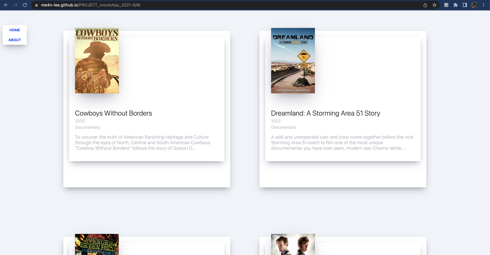

📌 Introduction  

어떤 질문이든, 어떤 문제든 마주쳤을때 당당하게 대답하기 위해, 그리고 누구에게나 필요한 사람이 되고자 하기에,

새로운 기술과 트렌드를 익혀 꾸준히 성장하기를 노력하는 개발자 이민혁 입니다.  

# MINHYEOK LEE

## _📌 About Me_

- 생년월일 : 1996.12.19
- 이메일 : minhk.lee21@gmail.com
- 학력 
1. 연세대학교 미래캠퍼스 통계학과 전공 
2. 복수 전공으로 연세대학교 미래캠퍼스 소프트웨어학과 졸업 예정

## _📌 Skills_

- FrontEnd
  

      
       
      
      
       
      
      
      
  

- BackEnd
  

       
      
      
      
      
  

- Version Control
  

      
      
  

## _📌 Contents_
> [Project Index](#project-index)
>   > 1. SIDE PROJECT
>   > 2. CLONE
>   > 3. ALGORITHM
> ~Ing Index
> [Project Detail](#Project-Detail)
>   > 1. SIDE PROJECT
>   > 2. CLONE
>   > 3. ALGORITHM
> ~Ing Index

## _📌 Project Index_

> 1. SIDE PROJECT
- [movie app](#movie-app)
    - 프로젝트 기간 : ~2021/5
    - 사용 스택 : `#Javascript` `#Html` `#Css` `#React` `#Api` `#Github pages`

- [google app](#google-app)
    - 프로젝트 기간 : ~2021/7
    - 사용 스택 : `#Javascript` `#Html` `#Css` `#React` `#Api`
- find macbook
    - 프로젝트 기간 : ~2022/7
    -
- errand(proto)
    - 프로젝트 기간 : ~2022/10
    -
- basic database
    - 프로젝트 기간 : ~2022/11
    -
- errand(team)
    - 프로젝트 기간 : ~2022/12
    -
> 2.CLONE
- airbnb
    - 프로젝트 기간 : ~2021/4
    - 
- kakao talk
    - 프로젝트 기간 : ~2021/5
    - 
- youtube
    - 프로젝트 기간 : ~2021/8
    -
- instagram
    - 프로젝트 기간 : ~2021/12
    -
- uber eats
    - 프로젝트 기간 : ~2022/3
    -
> 3.ALGORITHM
- 2022-2nd(college)
    - 프로젝트 기간 : ~2022/12
    -
- 2022-summer(college)
    - 프로젝트 기간 : ~2022/8
    -

## _📌 Project Detail_

>1. SIDE PROJECT

## [Movie App](https://github.com/me4n-lee/PROJECT_movieApp_2021-5)

### _프로젝트 기간 : ~2021/5_
### _의도_
- mark-up의 숙련을 위함
- api 사용법을 익히기 위한 간단한 프로젝트 만들기
### _사용 스택_
- `#Javascript` -> React.js
- `#Html` 
- `#Css` 
- `#Api`
- `#Gh-pages`
### _주요기능 및 설명_
- Html, Css, React.js를 활용하여 프론트엔드를 구현
- API 를 활용해 영화들의 포스터, 제목, 요약내용, 장르와 같은 데이터 저장, 출력
- Github pages를 활용해 결과물 배포
### _결과물_
- Github pages로 배포 완료 -> [gh-pages](https://me4n-lee.github.io/PROJECT_movieApp_2021-5)

 

## [Google App](https://github.com/me4n-lee/PROJECT_movieApp_2021-5)

### _프로젝트 기간 : ~2021/7_
### _의도_
- 시간, 날씨와 같은 기본적인 api를 활용하는 방법을 익히기 위함
- google 확장프로그램과 같은 서비스 만들기
### _사용 스택_
- `#Javascript`
- `#Html` 
- `#Css`
- `#Api`
- `#Gh-pages`
### _주요기능 및 설명_
- Html, Css, Js를 활용하여 프론트엔드를 구현
- API 를 활용해 실제 서비스되고 있는 시간표현이나 todo-list 생성
- 랜덤한 정보를 가져올수 있는 함수 구현
- Github pages를 활용해 결과물 배포
### _결과물_
- Github pages로 배포 완료 -> [gh-pages](https://me4n-lee.github.io/PROJECT_googleApp_2021-7)

#
>2. CLONE

#
>3. ALGORITHM