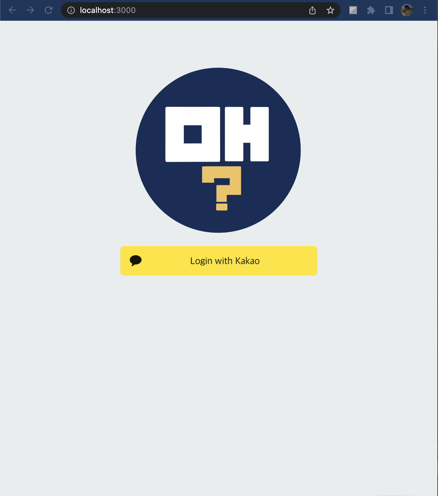
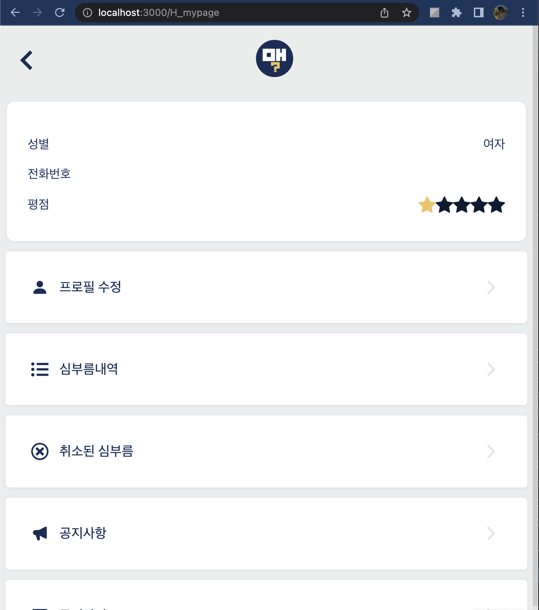
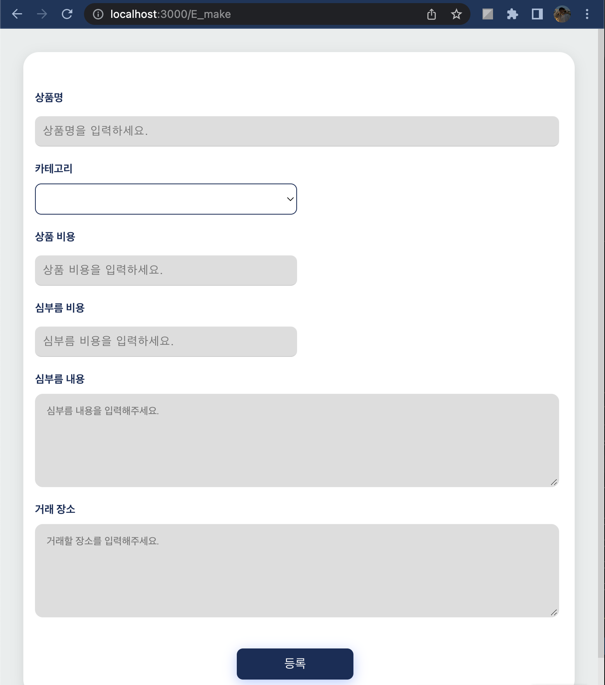

📌 Introduction  

어떤 질문이든, 어떤 문제든 마주쳤을때 당당하게 대답하기 위해, 그리고 누구에게나 필요한 사람이 되고자 하기에,

새로운 기술과 트렌드를 익혀 꾸준히 성장하기를 노력하는 개발자 이민혁 입니다.  

# MINHYEOK LEE              

## _📌 About Me_

- 생년월일 : 1996.12.19
- 이메일 : minhk.lee21@gmail.com
- 학력 
1. 연세대학교 미래캠퍼스 통계학과 전공 
2. 복수 전공으로 연세대학교 미래캠퍼스 소프트웨어학과 졸업 예정

## _📌 Skills_

- FrontEnd
  

      
       
      
      
       
      
      
      
  

- BackEnd
  

       
      
      
      
      
  

- Version Control
  

      
      
  

## _📌 Contents_
###  __Project Index__
1. side project
2. clone
3. study
### __Project Detail__
1. side project
2. clone
3. study
### __~Ing Index__
1. project

## _📌 Project Index_

> 1. side project
- [movie app](#movie-app)
    - 프로젝트 기간 : ~2021/5
    - 사용 스택 : `#Javascript` `#Html` `#Css` `#React` `#Api` `#Github pages`

- [google app](#google-app)
    - 프로젝트 기간 : ~2021/7
    - 사용 스택 : `#Javascript` `#Html` `#Css` `#React` `#Api`

- [Find Macbook](#find_macbook)
    - 프로젝트 기간 : ~2022/7
    -

- [Errand(proto)](#errandproto)
    - 프로젝트 기간 : ~2022/10
    - 사용 스택 : `#Javascript` `#Html` `#Css` `#React` `#Api` `#Github pages`

- [Basic Database](#basic-database)
    - 프로젝트 기간 : ~2022/11
    - 사용 스택 : `#Mariadb` `#Jsp` `#Jdbc` `#Eclipse` `#Tomcat`

- [Errand(team)](#errandteam)
    - 프로젝트 기간 : ~2022/12
    - 사용 스택 : `#Docker` `#Mysql` `#Aws` `#Javascript` `#Html`  `#Css` `#Api` `#Gh-pages` `#Notion`

> 2.clone

- [Airbnb](#airbnb)
    - 프로젝트 기간 : ~2021/4
    - 사용 스택 : `#python` `#django` `#Javascript` `#Html` `#Css` `#Api`

- [KakaoTalk](#kakaotalk)
    - 프로젝트 기간 : ~2021/5
    - 사용 스택 : `#Html` `#Css` `#Gh-pages`

- [Youtube](#youtube)
    - 프로젝트 기간 : ~2021/8
    - 사용 스택 : `#Javascript` `#Css` `#Pug` `#MongoDB` `#Express` `#heroku`

- [Instagram](#instagram)
    - 프로젝트 기간 : ~2021/12
    - 사용 스택 : 

- [Uber eats](#uber-eats)
    - 프로젝트 기간 : ~2022/3
    - 사용 스택 : 

> 3.algorithm
- 2022-2nd(college)
    - 프로젝트 기간 : ~2022/12
    - 
- 2022-summer(college)
    - 프로젝트 기간 : ~2022/8
    -

## _📌 Project Detail_

#

1. PROJECT

-----------------------------------

## [Movie App](https://github.com/me4n-lee/PROJECT_movieApp_2021-5)

### _프로젝트 기간 : ~2021/5_
### _keyword_
- React, API
### _의도_
- mark-up의 숙련을 위함
- api 사용법을 익히기 위한 간단한 프로젝트 만들기
### _사용 스택_
- `#Javascript` -> React.js
- `#Html` 
- `#Css` 
- `#Api`
- `#Gh-pages`
### _주요기능 및 설명_
- frontend : Html, Css, React.js
- API 를 활용해 영화들의 포스터, 제목, 요약내용, 장르와 같은 데이터 저장, 출력
- Github pages를 활용해 결과물 배포
### _결과물_
- Github pages로 배포 완료 -> [gh-pages](https://me4n-lee.github.io/PROJECT_movieApp_2021-5)

 

## [Google App](https://github.com/me4n-lee/PROJECT_movieApp_2021-5)

### _프로젝트 기간 : ~2021/7_
### _keyword_
- Javascript, API
### _의도_
- 시간, 날씨와 같은 기본적인 api를 활용하는 방법을 익히기 위함
- google 확장프로그램과 같은 서비스 만들기
### _사용 스택_
- `#Javascript`
- `#Html` 
- `#Css`
- `#Api`
- `#Gh-pages`
### _주요기능 및 설명_
- frontend : Html, Css, Js
- API 를 활용해 실제 서비스되고 있는 시간표현이나 todo-list 생성
- 랜덤한 정보를 가져올수 있는 함수 구현
- Github pages를 활용해 결과물 배포
### _결과물_
- Github pages로 배포 완료 -> [gh-pages](https://me4n-lee.github.io/PROJECT_googleApp_2021-7)

 

## [Find Macbook](https://github.com/me4n-lee/PROJECT_movieApp_2021-5)

### _프로젝트 기간 : ~2021/7_
### _keyword_
- Javascript, API
### _의도_
- 시간, 날씨와 같은 기본적인 api를 활용하는 방법을 익히기 위함
- google 확장프로그램과 같은 서비스 만들기
### _사용 스택_
- `#Javascript`
- `#Html` 
- `#Css`
- `#Api`
- `#Gh-pages`
### _주요기능 및 설명_
- frontend : Html, Css, Js
- API 를 활용해 실제 서비스되고 있는 시간표현이나 todo-list 생성
- 랜덤한 정보를 가져올수 있는 함수 구현
- Github pages를 활용해 결과물 배포
### _결과물_
- Github pages로 배포 완료 -> [gh-pages](https://me4n-lee.github.io/PROJECT_googleApp_2021-7)

 

## [Errand(proto)](https://github.com/me4n-lee/PROJECT_errand_proto_2022-10)

### _프로젝트 기간 : ~2022/10_
### _keyword_
- Mark-up(html, css)
### _의도_
- 프로젝트를 진행하기 전, 결과물 예상을 위한 프로토타입을 제작하기 위함
- 기초적인 html, css를 활용해 frontend 기능 구현
### _사용 스택_
- `#Html` 
- `#Css`
- `#Gh-pages`
### _주요기능 및 설명_
- frontend : Html, Css
- Github pages를 활용해 결과물 배포
### _결과물_
- Github pages로 배포 완료 -> [gh-pages](https://me4n-lee.github.io/PROJECT_errand_proto_2022-10/)

 

## [Basic database](https://github.com/me4n-lee/PROJECT_basicDatabase_2022-11)

### _프로젝트 기간 : ~2022/11_
### _keyword_
- Mariadb, Java
### _의도_
- eclipse 사용법을 익히기 위함
- java(jsp, jdbc)의 사용법을 익히기 위함
- 실제 데이터베이스를 구축해, front와 backend를 연결하는 기초적인 방법을 배우기 위함
- 가상환경 tomcat을 활용해 결과물 구현하기
### _사용 스택_
- `#Mariadb` -> Mysql
- `#Jsp`
- `#Jdbc`
- `#Eclipse`
- `#Tomcat`
### _주요기능 및 설명_
- frontend : Html, Jsp
- backend : Mysql(mariadb), Tomcat, Jdbc
- eclipse를 활용한 이유는, java를 구현해 내기 위한 환경에 최적이라고 생각했기 때문
- form action을 활용해 도메인과 폴더내 파일 구조를 확립
- 정보를 직접 입력해 db와 소통해서 데이터를 저장하는 기능을 구현
- 저장된 데이터를 보여질수 있도록 하는 기능 구현
- Tomcat 서버를 활용해 결과물 배포
### _결과물_
- dev 페이지로 구현했기에 사진으로 대체 하겠습니다. tomcat을 활용해 결과물 배포 하였습니다.

 

## [Errand(team)](https://github.com/me4n-lee/PROJECT_errand_frontend_2022-12)

### _프로젝트 기간 : ~2022/12_
### _keyword_
- Docker, Notion, Javascript
### _의도_
- 프로젝트를 통해 협업을 위한 docker, notion과 같은 툴을 익히기 위함
- frontend, backend의 소통을 원할하게 해주는 역할에 임함으로써, 여러 의견을 조율하는 방법을 익히기 위함
- node와 react의 코딩 능력을 향상시키기 위함
### _사용 스택_
- `#Docker`
- `#Mysql`
- `#Aws`
- `#Javascript` -> React, Node
- `#Html` 
- `#Css`
- `#Api`
- `#Gh-pages`
- `#Notion`
### _주요기능 및 설명_
- frontend : Html, Css, Js(react)
- backend : Js(node), Docker, 팀원(Java), Mysql
- 심부름 어플 -> 사람과 사람간의 심부름에 대한 거래 과정을 구현함
- 기능에 대한 자세한 사항은 팀프로젝트 깃에 있습니다.
- 소프트웨어 공학에 관련된 서류들 또한 팀프로젝트 깃에 포함되어 있습니다.
- Github pages를 활용해 결과물 배포
### _결과물_
- Github pages로 배포 완료 -> [gh-pages](https://me4n-lee.github.io/PROJECT_errand_frontend_2022-12)
    + 현재 aws서버로 kakao계정을 입력받게 되어 코드 수정을 해야만 확인이 가능합니다. 시간 여유가 되는대로 수정하겠습니다. 현재 사진은 dev버전으로 수정해 올려두겠습니다.
- 전체 프로젝트 깃 주소 -> [team-git](https://github.com/Software-Engineering-07)

#
#

2. CLONE

-----------------------------------

## [Airbnb](https://github.com/me4n-lee/CLONE_Airbnb_2021-4)

### _프로젝트 기간 : ~2021/4_
### _keyword_
- Aws, Python, Django
### _의도_
- pip, 즉 가상환경에 대한 이해, 구현
- RestApi에 대한 이해, 구현
- python, django를 활용해서 웹페이지의 백엔드를 제작, 프론트와 연결 후 결과물 도출
- aws S3, EC2를 활용해 가상 데이터베이스, 가상 서버 구현
### _사용 스택_
- `#python`
- `#django`
- `#javascript` -> vanilla.js
- `#Html` 
- `#Css` -> Scss, TailwindCss
- `#Api` -> RestAPI
- `#Aws` -> S3, EC2
### _주요기능 및 설명_
- frontend : Html, Css, vanilla.ks, Scss, TailwindCss
- backend : python, djangoDB
- etc : restapi, aws
- django에는 웹페이지가 기초적을 갖추어야할 form이 기본 제공되기 때문에 커스터마이징을 통해 서비스를 구현
- github, kakaotalk RestAPI를 활용해 로그인, 로그아웃 구현
- django-seed 모듈을 활용해 test data 생성
- get,post를 활용해 메세지 구현
- create로 예약 구현
### _결과물_
- django server를 활용해 관리자 페이지를 열어 그 속에서 실시간으로 수행
- aws를 활용해 가상 서버를 구현, 실제로 사용 가능한 환경 구축

 

## [KakaoTalk](https://github.com/me4n-lee/CLONE_kakaoTalk_2021-5)

### _프로젝트 기간 : ~2021/5_
### _keyword_
- 순수 Html, 순수 Css
### _의도_
- 기본 Html, Css 조작을 통해 파일간 구조, 폴더 구조에 대해 공부하기 위함
- mark-up 에 대한 숙련도 향상을 위함
### _사용 스택_
- `#Html` 
- `#Css`
- `#Gh-pages`
### _주요기능 및 설명_
- frontend : Html, Css
- backend : 
- etc : Gh-pages
- 순수 html을 사용하여, 파일과 파일간의 관계를 표현함 
- html을 활용해 다양한 파일 구조, 프론트 형식을 표현함(화면크기에 따른 다른 결과 출력, 덮어지는 형식의 페이지등)
- 순수 css를 활용해, 기초적인 디자인이나 애니메이션을 구현함
- Github pages를 활용해 결과물 배포
### _결과물_
- Github pages로 배포 완료 -> [gh-pages](https://me4n-lee.github.io/CLONE_kakaoTalk_2021-5)

 

## [Youtube](https://github.com/me4n-lee/CLONE_youtube_2021-8)

### _프로젝트 기간 : ~2021/8_
### _keyword_
- Pug, MongoDB, Heroku
### _의도_
- pug와 babel을 활용해 html을 대체하는 방법 학습
- 영상자료 저장과 입력, 활용하는 방법을 익히기 위함
- mark-up 에 대한 숙련도 향상을 위함
- mongoose를 통해 mongoDB에 대한 개념과, 구현을 익히기 위함
- heroku 사용법을 익히기 위함
### _사용 스택_
- `#Javascript` node.js
- `#Css` -> scss
- `#Pug` -> babel, nodemon
- `#MongoDB` -> mongoose
- `#Express`
- `#heroku`
### _주요기능 및 설명_
- frontend : Html, Scss, pug, vanila.js
- backend : node.js , mongoDB, express
- etc : Gh-pages, heroku
- 영상 재생, 댓글 추가, 동영상 검색등의 기능을 구현
- 로그인 페이지를 제작해 가입과 로그인이 가능하도록 했음, git RestAPI를 활용해 인증, 로그인을 구현
- mongoDB, express 를 활용해 데이터베이스와 백엔드 구현
- heroku를 활용해 결과물 배포
### _결과물_
### _결과물_
- Heroku로 배포 완료 -> [Heroku](https://youtube-clone-me4n.herokuapp.com/)
- 2022/11 추가사항 : hereku 결제 이슈로 구현된 페이지가 출력되고 있지 않습니다. 코드상으로는 이상 없으나, 아직 해결책을 찾지 못했습니다. 현재 mongoDB, heroku의 기능 확인은 불가능한 상태 입니다. 이슈 수정하는대로 커밋 하겠습니다. (사진 파일은 관리자페이지로 업로드되었습니다.)

 

## [Instagram](https://github.com/me4n-lee/CLONE_Airbnb_2021-4)

### _프로젝트 기간 : ~2021/12_

 

## [Uber eats](https://github.com/me4n-lee/CLONE_Airbnb_2021-4)

### _프로젝트 기간 : ~2022/3_

 

#
>3. ALGORITHM